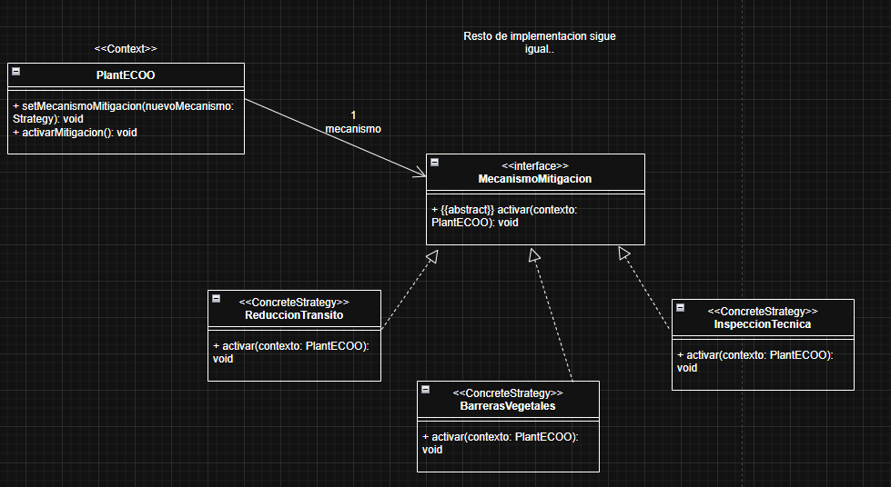

* Actividades - Parte 1 (El diseño actual)
1. Indique el nombre del patrón de diseño que se utiliza.
El patrón utilizado es Composite.

2. Explique con sus palabras (entre 2 y 5 renglones) cuál es el objetivo del patrón indicado en el inciso anterior.
El objetivo del patrón Composite es componer objetos en estructuras de árbol para representar jerarquías, permitiendo al cliente (el sistema) tratar a los objetos individuales (Sensor) y a las composiciones de objetos (Zona) de manera uniforme. Esto significa que se le puede pedir el valorCO2() a la red sin importar si es un único sensor o un sector complejo, ya que la responsabilidad se delega recursivamente.

- (Nota: La frase "tratar de manera uniforme" es el corazón de este patrón. Si falta esa frase, la cátedra lo considera incompleto).

* Actividades - Parte 2 (La nueva funcionalidad)
3. Indique el nombre del patrón que aplicaría para incorporar la posibilidad de definir el mecanismo de mitigación.
El patrón a aplicar es Strategy.

4. Explique con sus palabras (entre 2 y 5 renglones) cuál es el objetivo del patrón indicado en el inciso anterior.
El objetivo de Strategy es definir una familia de algoritmos (los mecanismos de mitigación), encapsular cada uno en una clase separada y hacerlos intercambiables. Esto permite que el comportamiento de la clase contexto (PlantECOO) pueda variar dinámicamente en tiempo de ejecución según se necesite, sin modificar su código interno, cumpliendo con el principio Open/Closed.

5. UML:

6. Punto 6: Codifique las clases que involucran el patrón
Acá te piden la interfaz (el <<Strategy>>) y la clase concreta que implementa la reducción de tránsito (la <<ConcreteStrategy>>).

Como el enunciado original decía explícitamente "que la clase PlantECOO colabore con su solución", le pasamos el contexto por parámetro al método, tal como hiciste quedó en el UML.

// Interfaz Strategy
public interface MecanismoMitigacion {
    void activar(PlantECOO contexto);
}

// Concrete Strategy
public class ReduccionTransito implements MecanismoMitigacion {
    @Override
    public void activar(PlantECOO contexto) {
        // Implementación requerida por el enunciado para simplificar
        System.out.println("activando reducción temporal del tránsito");
    }
}

7. Escriba el codigo para definir por defecto el mecanismo de mitigación "Reducción temporal del tránsito". Recuerde que se podría cambiar el mecanismo.
8. Escriba en la clase correspondiente el método activarMitigacion() que desencadene el mecanismo de mitigación.

public class PlantECOO {
    private String nombre;
    private ElementoRed raiz;
    
    // Referencia a la estrategia actual
    private MecanismoMitigacion mecanismo; 

    // Constructor
    public PlantECOO(String nombre, ElementoRed raiz) {
        this.nombre = nombre;
        this.raiz = raiz;
        
        // --- RESPUESTA PUNTO 7 (Primera parte) ---
        // Definir por defecto el mecanismo "Reducción temporal del tránsito"
        this.mecanismo = new ReduccionTransito(); 
    }

    // --- RESPUESTA PUNTO 7 (Segunda parte) ---
    // Considerar que se podría cambiar el mecanismo (Setter)
    public void setMecanismoMitigacion(MecanismoMitigacion nuevoMecanismo) {
        this.mecanismo = nuevoMecanismo;
    }

    // --- RESPUESTA PUNTO 8 ---
    // Método donde se desencadena el mecanismo de mitigación
    public void activarMitigacion() {
        // El contexto delega la ejecución a la estrategia actual, 
        // pasándose a sí mismo como colaborador.
        this.mecanismo.activar(this);
    }
    
    // ... (restos de métodos de PlantECOO) ...
}